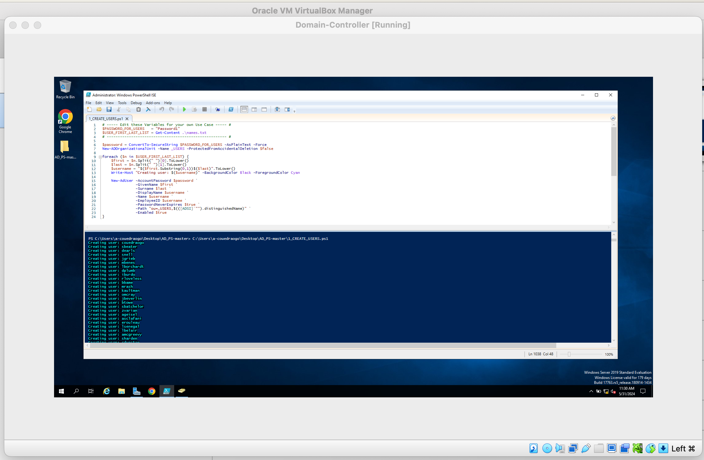

# active-directory_project
<h2>Description</h2>

This script generates usernames by combining the first letter of each user's first name with their last name. A single password will be assigned to all 1000 users in this scenario.

